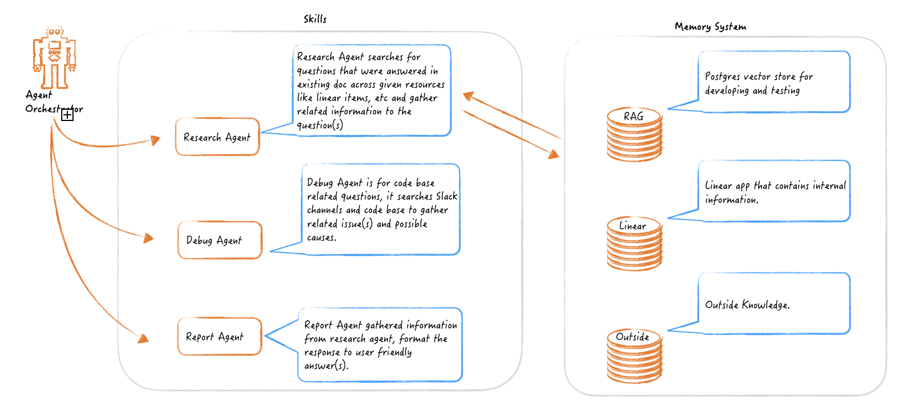

# onboard-pilot

This is an app that help people onboard, and keep everything on track by answering their questions
according to information from linear(ADO, confluent and Slack in the future) 


## Flow Chart
The data flow of the project:

```commandline
               [User Input]
                    │
            [Router Agent (Ollama)]
          ┌─────────┼─────────┐
          │ (debug) │(research)│ (other)
          ▼         │         ▼
   [Debug Skill]    │     [Direct Chat / Clarification]
   (Tools: Logs/    │
    Code Context)   │
          │         ▼
          │   [Query Transformer]
          │   (Extracts RAG query + Linear filters)
          │         │
          │   ┌─────┴──────────────────┐ (Parallel Fetch)
          │   ▼                        ▼
          │ [pgvector RAG]       [Linear API Search]
          │   └─────┬──────────────────┘
          │         ▼
          │   [Relevance Grader (CRAG)]
          │         ├── (Relevant) ───────────────┐
          │         └── (Irrelevant) ──► [Web/Ext Search]
          │                                       │
          └─────────────────┬─────────────────────┘
                            ▼
                  [Synthesizer / Summary Agent]
                            │
                     [Final Response]
```
Below is how agent interact:


## Tests

### Golden Dataset
Golden dataset was created using information in [Google Java Guideline](https://google.github.io/styleguide/javaguide.html) 
and [OpenAI Production best practices](https://developers.openai.com/api/docs/guides/production-best-practices) against RAG.
`evaluation_dataset1.csv` has simplest data, which all questions can be found in RAG using single chunk.
`evaluation_dataset2.csv` has questions that can be found in RAG using single chunk, also it contains question that cannot be answered with RAG.
`evaluation_dataset3.csv` has questions that can be found in RAG using multiple chunks.


## Examples 
Questions and good answers:
- A: what is the (deployment/testing/oncall/xxx) steps

  Q: the deployment/testing steps are: 
  Use xxx links, fill in the information which get from xxx, click button, at the same time monitoring xxx to confirm...(summarize the confluent page information)
  Here are the links that might be useful to you(some recording links, confluent links, Slack messages links)


- A: How can I complete this story xxx/Who is the contact for item xxx in story xxx

  Q: This story is asking..., works are required in:
  - add new fields xxx in repo xxx class xxx
  - create new api xxx in repo xxx
  - ...
  Here are something that might be missing/unclear from the stories: 
  - Figma design links are missing
  - ...
  please check with xxx(story creator name or PM name in RAG)
  

- A: I am about to release feature in ADO xxx, what I might miss? Validate the checklist for me
  
  Q: According to story requirement, I found below items have been completed:
  - PR in xxx repo has been done, pipeline look good
  - 
  Below items needed to be double check, we found your note in the story and Slack message
  - Here is something you noted down xxx weeks ago
  - Integration tests needed to be done
  - xxx API/key vault needs to be ready in all env


- A: what is the S3/k8s installation/launch app/Colima start/etc commands
  
  Q: The command is `./gradlew ...`, please make sure xxx is up and running
  
